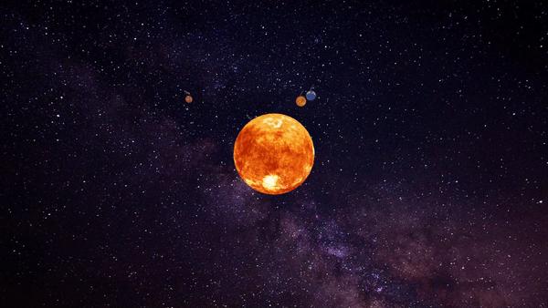

# Solar System with Processing
## About the author
Miguel Herrera Álvarez. Last-year Computer Engineering student in the University of Las Palmas de Gran Canaria.

## Develop
For this project, I decide to use 3 classes:
- One for the  satellites. This class handle the planets' satellites rotation and translation.
- One for the planets. This class define a planet and manage it movement, also, it create the object Satellite in case of this planet has one.
- Finally, the last class handle the center star, in this case, the Sun, and has an ArrayList with all the planets it has around it.
Each class has its own file and exists one more file with the main program, which work is to set up all the components, create the Sun and paint it with its planets and satellites.
### Decisions
- I tried to recreate the real scale between the planets and it's distance with the Sun, for this reason, Jupiter is out of the screen most of time due to its orbital radius.
- I used random methods to decide the satellites radius and the planets and satellites speed on each execution.
- Each planet has a label on top with its name.

## Tools and references
- [Processing 3.5.4](http://processing.org/)

## Result
